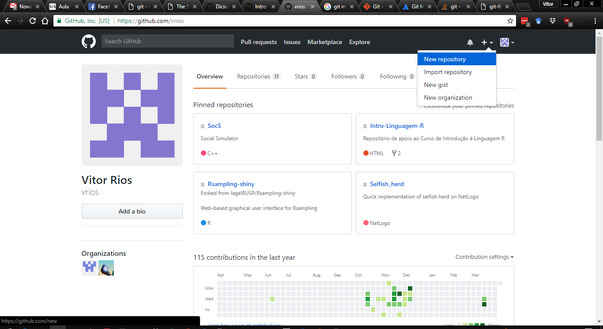
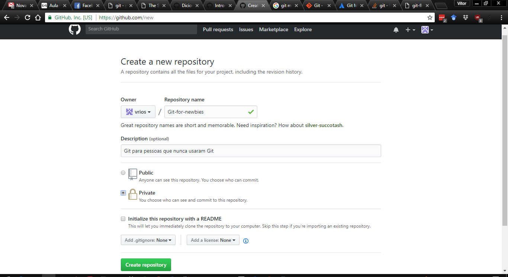
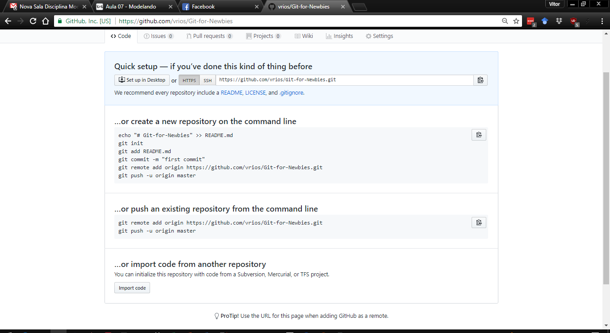
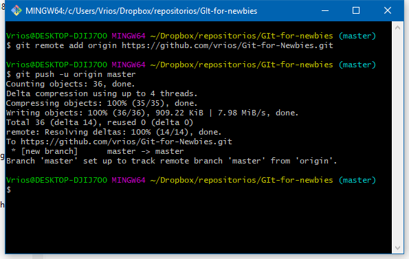
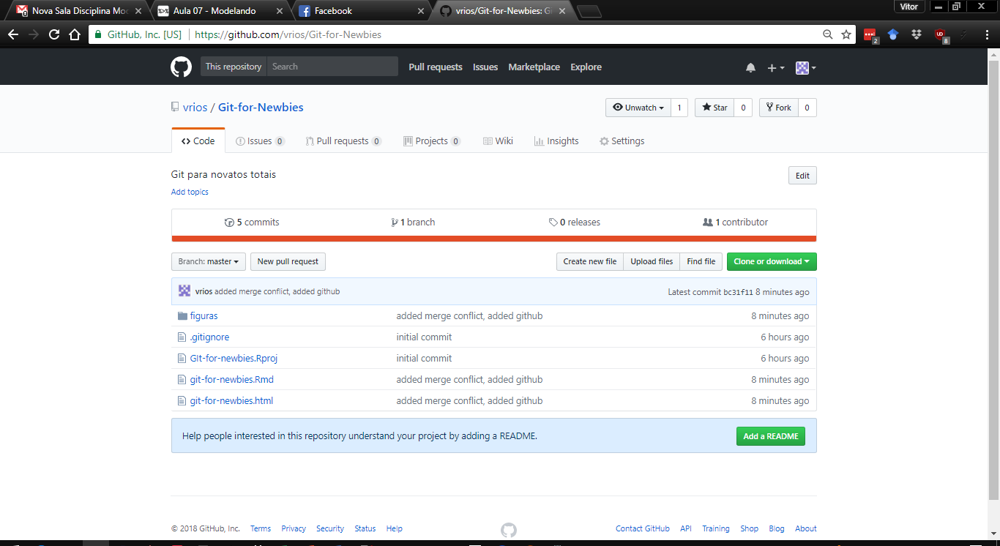
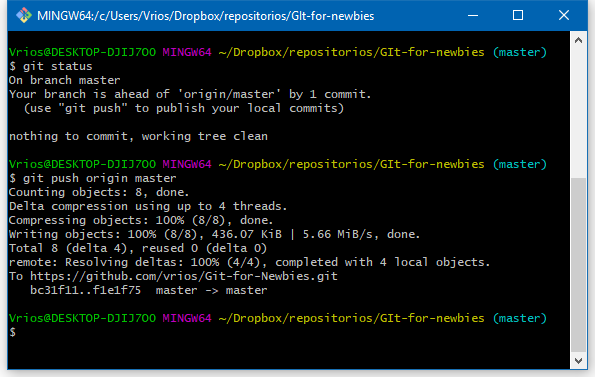
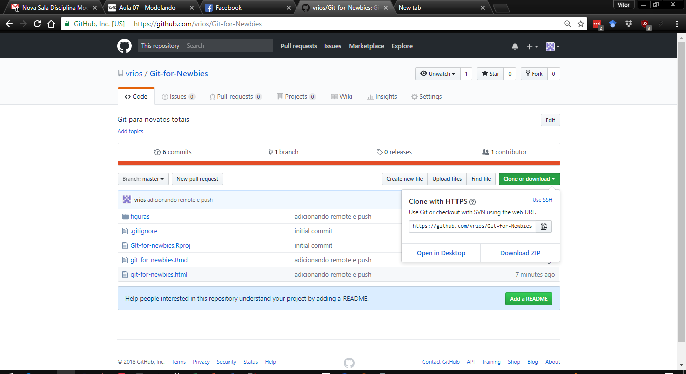
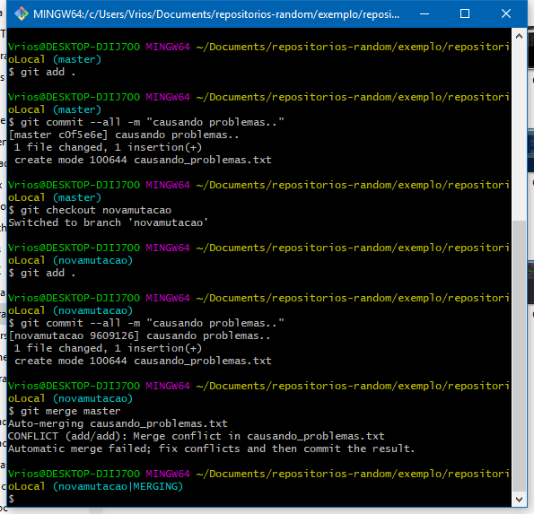
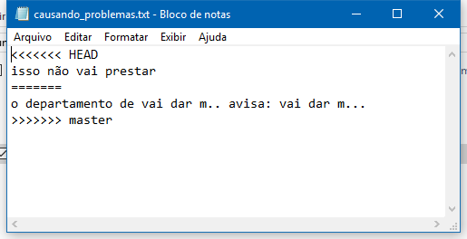

Controle de versão: como não deixar isso acontecer com você

  

***
- (orientador): "Tire essa parte x, e faça essa outra análise y"  
- (orientador um mês depois): "Tire essa parte y, e faça essa outra análise x"   
- (você) Raiva, ódio, desespero,  procurar em que versão estava salvo x

Controle de versão significa dar um nome e um número específico para cada versão de um arquivo. Assim você não perde seu trabalho e pode restaurar aquela parte que seu orientador mandou você tirar, quando ele(a) mandar colocar de volta   

Salvar cada versão em um arquivo separado com nomes diferentes estilo  `"versao 1.docx"`, `"versão2.docx"`, `"versão final.docx"`, `"versao final correções.docx"`, `"versão final correções definitiva.docx"`, `"versão final correções USAR ESTA.docx"`, `"versão final correções USAR ESTA 2.docx"`, NÃO é controle de versão

Lembre-se: fazer manualmente quando se pode automatizar é errado!

***
# Git
Git é o principal sistema de controles de versão atualmente  
- Vantagens: uma infinidade de tutoriais e sites de ajuda, rápido e leve, integrado com maioria dos softwares de programação, multiplataforma   
- Desvantagens: linha de comando, comandos crípticos, dá medinho no começo  

Conceitos básicos (por alto):

- Repositório: lugar onde o código vive. O repositório padrão é uma pasta no seu computador. Repositórios em outros computadores são chamados de `remote`. Cada remote recebe um nome e tem um endereço próprio. Por convenção, se existe um repositório remoto central, ele será chamado de `origin`  

- Commit: uma versão salva do seu código, com nome, número, e nome de quem fez, acompanhado de uma breve descrição de o que mudou (`commit message`). Pode ser de um só arquivo ou de vários.   

- Diff: comando que compara as diferenças entre `commits` (versões) do código, linha por linha. Serve para ver o que mudou de uma versão para outra   

- Merge: quando duas versões do mesmo arquivo estão em conflito (`merge conflict`), o Git pede para você fundir (`merge`) as duas, escolhendo quais linhas serão mantidas na versão final. É a parte mais chata do Git   


***

- Status: comando que te informa o esstado atual do seu repositório local, se houve alguma alteração em algum arquivo, e se ele está incronizado com o `remote`  

- Pull e Push: `pull` copia os `commits` de um repoitório remoto (`remote`) para seu repositório local. `push` envia os `commits` do seu local para o `remote`. _Enviar para o `remote` garante um backup atualizado fora da sua máquina  _   

- Branch: um conjunto de versões (`commits`) que formam uma linha do tempo separada de outros branchs. Geralmente usado quando se quer testar jeitos diferentes de fazer algo, ou versões experimentais. O branch padrão é o `master`, e cada branch tem seu nome   

- Clonar: copiar um repositório existente  

- Init: criar um repositório novo  

- `.gitignore` - arquivo com os nomes e tipos de arquivo que você quer que o git ignore

***
# Repositórios online
São empresas que fornecem espaço para você criar seu `remote` nos servidores delas  

- Vantagens: espaço gratuito, ferramentas de colaboração, comunidade, padrão da indústria, backup online acessível de qualquer lugar, encriptação e ssh  

- Desvantagens: Seu código fica num servidor alheio, algumas opções são pagas   

Bitbucket: sem limite de repositórios privados, limita número de colaboradores na opção gratuita

GitHub: Somente repositórios públicos na opção gratuita, pacote educacional gratuito permite repositórios privados, padrão para usuários do R, interface mais amigável

# Interfaces gráficas
GitKraken: software com interface bonitinha para gerenciar seus repositórios, funciona com qualquer remote

Qt Creator: oferece integração com Git diretamente na interface, principais ações são feitas sem linha de comando

RStudio: oferece integração com Git diretamente na interface, principais ações são feitas sem linha de comando

***
# Neste curso, usaremos Git, GitHub e GitKraken
## Passo a passo:
- Instalar Git e GitKraken
- Configurar nome de usuário e email no Git 
- Criar uma conta no GitHub (lembre: GihUb é o site, git é o programa)

- Criar um repositório no GitHub
- Clonar o repositório do GitHub
- Fazer alterações nos arquivo do projeto
- Salvar alterações
- Dar `commit` no repositório local via linha de comando, Gikraken
- Dar `pull` no repositório local via  linha de comando,GitKraken (para evitar problemas de conflito caso alguem mais tenha alterado o projeto)
- Resolver problemas de `merge`
- Dar `push` no `remote` via  linha de comando, GitKraken


*** 
## Instalando o Git 
O Git está disponível com instruções de instalação em  [Git](https://git-scm.com/book/pt-br/v1/Primeiros-passos-Instalando-Git).

### Se você usa Linux
Provavelmente já tem uma versão do Git instalado (abra um terminal e digite `git` para descobrir), senão escolha uma opção abaixo.

1. Se você usa um Linux derivado do Debian, como Ubuntu ou Mint, abra um terminal e digite `apt-get install git`.

2. Se você usa um Linux derivado do Fedora, digite `yum install git-core`.

3. Se você não sabe de qual distribuição seu Linux é derivado, muito provavelmente é uma versão do Debian/Ubuntu.

### Se você usa Mac:
1. Baixe o instalador em [Git OSX](http://sourceforge.net/projects/git-osx-installer/), ou, por linha de comando, se você tiver MacPorts instalado, digite `sudo port install git-core +svn +doc +bash_completion +gitweb`

### Se você usa Windows:
1. Baixe o instalador em [Git for Windows](https://git-for-windows.github.io/) .
2. Execute o instalador e siga as instruções, aceitando as opções padrão.

***
## Configurando o Git  
Para usar o Git, você precisa criar um nome de usuário e um email que serão usados para identificar todas suas ações. Para isso, abra uma janela de terminal, ou a janela do Git for Windows (veja em Programas -> Git -> Git Bash , e digite as linhas abaixo, substituindo `myName` pelo seu nome de usuário e `MyEmail` pelo seu endereço de email. Seu nome tem de vir entre aspas.

1. `git config --global user.name "myName"`
2. `git config --global user.email myEmail`


Estes dados ficarão associados a cada `commit` que você der. Para máquinas multi-usuário, sempre confira se seu nome e email estão corretos usando `git git config user.name`e `git config user.email`,  <span style="color:red">*antes*</span> de começar a trabalhar

***
# Como funciona o Git?
O git tem uma representação inicial dos arquivos no seu reposítório, o estado deles antes de qualquer alteração. Quando você mandar, ele irá comparar as versões atuais de cada arquivo com as versões armazenadas, e irá guardar o que houver de diferente entre a ultima versão registrada e a atual, junto com uma mensagem dizendo o que foi alterado

Importante: O Git não tem iniciativa, ele só funciona quando você mandar. Ele também só registra os arquivos que você mandar

Pense nessa versão inicial como primeiro fóssil da sua árvore filogenética: é o estado basal dos caracteres, e qualquer mudança será comparada a ela


***
# Criando seu repositório via linha de comando
No seu diretório alvo (aquele onde você quer criar seu repositório, ou em um projeto que já existe), abra uma janela de terminal (ou Git Bash no Windows) e digite:
```{r, engine = 'bash', eval = FALSE}
git init repositorioLocal
```


***
# Informações do seu repositório
`git init repositorioLocal` cria um diretório com nome `repositorioLocal`, vazio exceto por uma pasta `.git`. Não mexa em nada dentro desta pasta (se mexer explode). Podemos ver o estado atual do repósito usando `git status`


Não temos nenhum arquivo neste diretório. Vamos corrigir isso

***
# README
Por tradição, todo repositório tem um arquivo _README_ ou _README.MD_, que descreve os conteúdo e propósito do repositório. vamos criar um. Na linha de comando, digite

```{r, engine = 'bash', eval = FALSE}
touch README.MD
```

`touch` é um comando que cria um arquivo vazio. Você também pode criar um arquivo com seu editor favorito,ou colar um arquivo existente.

```{r, engine = 'bash', eval = FALSE}
git status
```


***
# Git add

O git percebeu que tem arquivos novos, mas esses arquivos ainda não estão sendo acompanhados. Precisamos dizer para o git adicionar os arquivos ao controle de versão

Fazer o git registrar que o arquivo mudou é um processo de dois passos: `git add` e `git commit`

`git add` diz ao git quais arquivos você quer registrar como alterados. Para adicionar todos os arquivo do diretório, o comando é `git add . `

```{r, engine = 'bash', eval = FALSE}
git add README.MD
git status
```


***
# Git commit
`git add` só adiciona os arquivos ao `staging area`, que é um meio-de-campo do git: ele diz quais arquivos alterados você quer incluir no seu próximo `commit`.

`commit` signignfica se comprometer, assumir. Dar o `commit`significa assumir as mudanças feitas no arquivo e registrá-las no controle de versão, com uma mensagem descritiva

```{r, engine = 'bash', eval = FALSE}
git commit -m "primeiro commit"
```

`-m` é um parâmetro que indica a mensagem do `commit`. Se você não usar `-m` o git abre o editor de texto padrão para você digitar a mensagem (geralmente o `vim`. Se você ficar preso no `vim`, respire fundo e digite `:q` que ele fecha). O commit mais recente é chamado de `HEAD`

O `commit` é a unidade básica do git, tudo gira em torno dele. Use mensagens descritivas das alterações que foram feitas. O conjunto de `commits` do seu repositório representa todas a história dos seus arquivos, desde a criação até a versão atual. Pense em cada `commit como um fóssil

***
Se você alterar mais de um arquivo de cada vez, é aconselhável fazer o `git add`e o `git commit` para cada arquivo separadamente (exceto para casos como alterações no .h e .cpp de uma função, onde as aterações são relacionada)

Use "commits atômicos": a menor mudança necessária para seu objetivo, de preferência um arquivo por vez

# Mãos à obra
Crie e altere vários arquivos , registrando as versões no git

***
# Interfaces gráficas
## GitKraken

GitKraken é uma interface gráfica para o Git. Ele não permite editar os arquivos diretamente, mas mostra uma linha do tempo do repositório, e permite usar os comandos básicos do Git como `add`, `commit`. `branch` e `merge`, e algumas funcionalidades avançadas, que não cobriremos aqui. A visualização gráfica da linha do tempo do repositório facilita muito a vida, principalmente quando o repositório é antigo ou várias pessoas colaboram. A vantagem dele é que funciona em Linux, Windows e OS X, e independe de editores de código como RStudio e QtCreator, o que permite controlar repositórios de qualquer tipo de arquivo.


***
# Até aí nada de mais
Qual a vantagem desse trabalho todo pra fazer o que você já fazia manualmente?

O Git é uma máquina do tempo. Do mesmo jeito que você armazena os estados do arquivos no histórico do repositório, você pode facilmente voltar a eles e recuperar versões antigas

Cada `commit` tem um RG, chamado de `commit ID`, que nos permite comparar versões dos arquivos, ou reverter para uma versão anterior. Ele também contém um ponteiro para o commit imediatamente anterior a ele. O conjunto dos commits, ligados através de seus ponteiros, permite reconstruir a história do repositório, e navegar por ela

Seu repositório é como uma filogenia de arquivos: desde a origem, cada modificação fica registrada no ramo da árvore (cada commit é um fóssil), e o táxon terminal do ramo é o estado atual do repositório. Se quisermos reverter para um estado anterior, é só indicar qual fóssil queremos acessar:

```{r, engine = 'bash', eval = FALSE}
git reset FOSSIL arquivo
```
Reseta o arquivo para o ponto que ele estava no commit FOSSIL
```{r, engine = 'bash', eval = FALSE}
git show FOSSIL:arquivo > arquivoMedroso
```
cria um arquivo chamado arquivoMedroso, como o conteudo de `arquivo` no commit FOSSIL. É só abrir arquivoMedroso e copiar e colar o que quiser pra o arquivo, dar um comit novo, e depois apagar arquivoMedroso

***
Se quisermos reverter diretamente `arquivo` pro estado FOSSIL

```{r, engine = 'bash', eval = FALSE}
git reset FOSSIL arquivo
```

CUIDADO: isso muda todo o conteúdo do arquivo pra versão gravada como FOSSIL, tudo que for alterado entre FOSSIL e o estado atual é perdido.

Usando o GitKraken, basta clicar em um commit para ver os arquivos que foram alterados nele. clicar no arquivo mostra o `diff`, isto é, o que foi mudado entre este commit e o commit anterior. Isto não altera o conteúdo dos arquivos.

***
# Indo além do básico
Com `init` criamos nosso repositório, e com `add` e `commit` nós cobrimos 70% das coisas que precisamos fazer para termos o controle de versão de nossos arquivos. `reset` no permite voltar no tempo e recuperar versões anteriores, que cobre mais uns 5%, `merge` (que vamos ver mais à frente) mais uns 15%, e o resto são comandos que se usa raramente, somente quando algo vai errado ou com reppositórios muito grandes. Mas o git brilha mesmo quando damos um passo além: backups online dos nossos dados, e colaboração com outras pessoas. Para isso, usamos _repositórios remotos_

***
# Repositórios remotos
Tudo que fizemos agora foi no repositório local, ou seja, no seu próprio computador. Git é descentralizado, isto é, cada pessoa tem seu repositório local, onde pode fazer suas alterações, e pode enviar essas alterações para um ou mais repositórios externos, chamados de `remote`. O remote nada mais é do que uma cópia do seu repositório local, que fica em outro computador, que pode ser o servidor do laboratório, o computador do seu orientador/aluno/colaborador, ou um site que fornece serviço de repositórios como GitHub.

Por convenção, cada projeto tem pelo menos um repositório `remote` que serve como agregador do trabalho de todos os envolvidos, e como backup externo do projeto. Esse repositório é geralmente chamado `origin`, mas pode ter qualquer nome. Cada remoto tem um nome próprio, e está associado a um endereço, como uma url https

Usaremos GitHub como repositório externo, pois ele permite repositórios privados gratuitos para acadêmicos.

***
No GitHub, clique em `New repository` para criar um repositório novo ou em `ìmport repository` para copiar um que já existe em outro site online



***
Escolha um nome para seu repositório, se ele vai ter `README`, `.gitignore` e um arquivo de licença



***
O `remote` foi criado vazio no GitHub, agora precisamos colocar nosso materiais nele. A isso chamamos de `push`. Para dar o push, precisamos dizer ao nosso repositório local o endereço e o nome do nos remote, usando o comando `git remote add`, seguido do nome e enderço do remoto. É só seguir as instruções do próprio GitHub:



***


***


*** 
Se o repósitório local tiver um origin, `git status` nos informa se estamos sincronizados ou não, ou ou seja, se há diferença entre o conteúdo do repositório local e o do remoto.

Sempre que quisermos mandar nossas alterações pro repositório origin, após darmos os commits locais, é só digitar:
```{r, engine = 'bash', eval = FALSE}
git push origin nomeDoBranch
```

`push` envia para origin tudo que está no repositório local



***
Se `origin` foi alterado, podemos trazer essa alteração para o repositório local e fazer um `merge` com apenas um comando. `Merge`é o ato de juntar as diferenças entre versões diferentes do repositório. 

`git pull` é o comando que puxa o conteúdo do remoto para seu local, e tenta fazer o `merge` automaticamente. Se ele não conseguir, ele vai te avisar. Veja como lidar com isso na sessão de `branches`, abaixo.

É considerado boa prática, antes de dar um `push`, sempre dar um `pull`, corrigir quaisquer conflitos de `merge`, e só então dar `push`. Isso evita que outras pessoas puxem os conflitos de merge do remoto para seus locais antes que você os corrija.

```{r, engine = 'bash', eval = FALSE}
git pull origin nomeDoBranch
```

`git pull` puro copia direto do `origin master`

***
Se quisermos copiar um repositório do github que ainda não temos no nosso computador, podemos usar o comando `git clone`, que é uma junção de `git init`e `git pull`



***
Agora explore a interface do GitHub. Tudo que podemos fazer na linha de comando pode ser feito no site. Crie e repositórios e envie arquivos, faça alterações e puxe elas para seu pc. O melhor jeito de aprender os comandos do git é mexendo num repositório

***
# Branches
## Especiação de arquivos
Um branch (ou ramo, ou galho) é como uma linha de desenvolvimento alternativa, com seus próprios commits, independente de outros branches. Podemos pensar um branch como sendo um evento de cladogênese, em que cada ramo pode ter seus traços (arquivos) alterados independentemente,e novos traços (arquivos) podem surgir ou ser apagados sem afetar os outros ramos.

se você reparar, na linha de comando, o nome do ramos aparece logo após o nome do diretório onde você se encontrar. Atualmente, estamos no ramo _master_, que é o ramo padrão que é criado quando o inicamos o repositórios. 

```{r, engine = 'bash', eval = FALSE}
git branch novamutacao #cria o ramo novamutacao
git checkout novamutacao #muda para o ramo novamutacao
```


***
Se criarmos um novo arquivo num ramo, ele só existirá nesse ramo:


***
# Pra quê isso?
Branches permitem testar coisas novas sem afetar o código original

O ramo original (sempre chamado de `master` por convenção) pode ser visto como a versão "release", "final" ou "estável" do código: todo o desenvolvimento e experimentações ocorre em branches, e quando estiver tudo funcionando, as alterações são passadas para o branch `master`

Por exemplo, se você quiser experimentar dois algoritmos diferentes para uma função, crie um branch para cada um e teste. O código original fica intocado, você não precisa criar várias cópias do projeto, e todo o histórico fica salvo no repositório. Ao terminar, passa o código vencedor pro `master` usando o comando `merge`

***
# Merge ou fusão de ramos
## transferência horizontal de genes entre ramos da árvore filogenética
`git merge`pega o último commit de um branch e une ele com outro branch. Isto pode gerar conflitos se houverem versões do mesmo arquivo que tenham a mesma linha com conteúdos diferentes.

Para fazer o merge, puxamos o HEAD de um branch pro outro. HEAD é o último commit do branch:

```{r, engine = 'bash', eval = FALSE}
# puxando de master para outro branch
git merge master
```


***
`git merge`junta os arquivos linha por linha. Se não houver conflito, o git junta tudo sem falar nada. Se a mesma linha for diferente nas duas versões do arquivo, o git marca a região de conflito da seguinte forma:

```{r, engine = 'bash', eval = FALSE}
<<<<<<< HEAD
texto branch atual
=======
texto outro branch
>>>>>>> arquivo
```



Para corrigir conflitos de merge, altere o arquivo mantendo a parte que desejar, e dê um novo commit. O git não deixa você alterar nada até que o conflito seja resolvido

