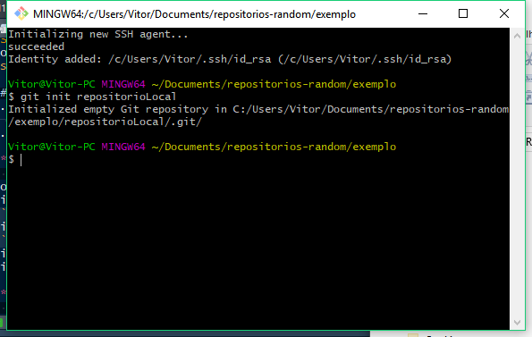
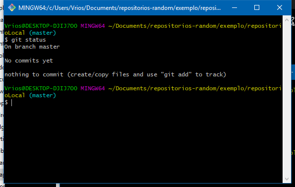
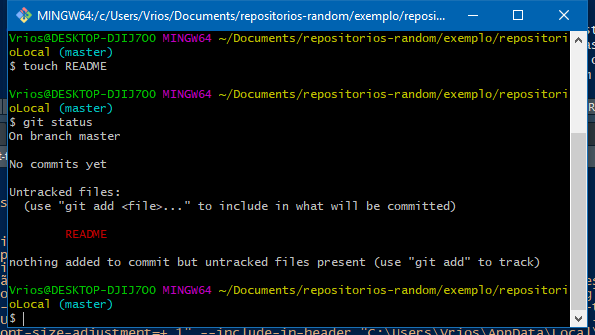
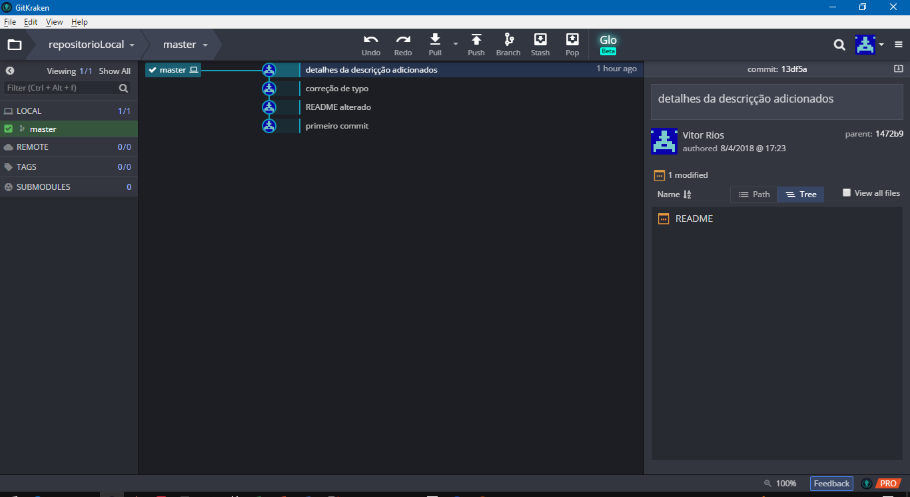
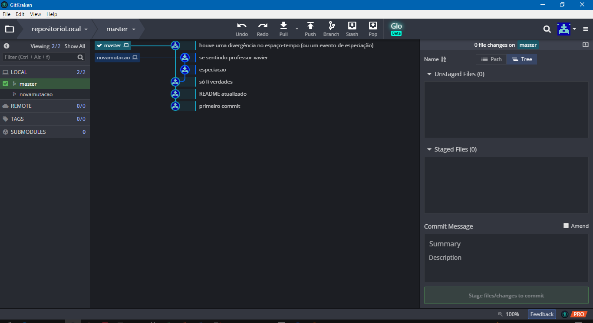
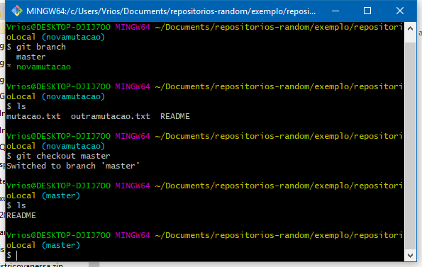

[Controle de versão: como não deixar isso acontecer com você](http://www.phdcomics.com/comics/archive/phd101212s.gif)  
- (orientador): "Tire essa parte x, e faça essa outra análise y"  
- (orientador um mês depois): "Tire essa parte y, e faça essa outra análise x"   
- (você) Raiva, ódio, desespero,  procurar em que versão estava salvo x

Controle de versão significa dar um nome e um número específico para cada versão de um arquivo. Assim você não perde seu trabalho e pode restaurar aquela parte que seu orientador mandou você tirar, quando ele(a) mandar colocar de volta   

Salvar cada versão em um arquivo separado com nomes diferentes estilo  `"versao 1.docx"`, `"versão2.docx"`, `"versão final.docx"`, `"versao final correções.docx"`, `"versão final correções definitiva.docx"`, `"versão final correções USAR ESTA.docx"`, `"versão final correções USAR ESTA 2.docx"`, NÃO é controle de versão

Lembre-se: fazer manualmente quando se pode automatizar é errado!

***
# Git
Git é o principal sistema de controles de versão atualmente  
- Vantagens: uma infinidade de tutoriais e sites de ajuda, rápido e leve, integrado com maioria dos softwares de programação, multiplataforma   
- Desvantagens: linha de comando, comandos crípticos, dá medinho no começo  

Conceitos básicos (por alto):

- Repositório: lugar onde o código vive. O repositório padrão é uma pasta no seu computador. Repositórios em outros computadores são chamados de `remote`. Cada remote recebe um nome e tem um endereço próprio. Por convenção, se existe um repositório remoto central, ele será chamado de `origin`  

- Commit: uma versão salva do seu código, com nome, número, e nome de quem fez, acompanhado de uma breve descrição de o que mudou (`commit message`). Pode ser de um só arquivo ou de vários.   

- Diff: comando que compara as diferenças entre `commits` (versões) do código, linha por linha. Serve para ver o que mudou de uma versão para outra   

- Merge: quando duas versões do mesmo arquivo estão em conflito (`merge conflict`), o Git pede para você fundir (`merge`) as duas, escolhendo quais linhas serão mantidas na versão final. É a parte mais chata do Git   


***

- Status: comando que te informa o esstado atual do seu repositório local, se houve alguma alteração em algum arquivo, e se ele está incronizado com o `remote`  

- Pull e Push: `pull` copia os `commits` de um repoitório remoto (`remote`) para seu repositório local. `push` envia os `commits` do seu local para o `remote`. _Enviar para o `remote` garante um backup atualizado fora da sua máquina  _   

- Branch: um conjunto de versões (`commits`) que formam uma linha do tempo separada de outros branchs. Geralmente usado quando se quer testar jeitos diferentes de fazer algo, ou versões experimentais. O branch padrão é o `master`, e cada branch tem seu nome   

- Clonar: copiar um repositório existente  

- Init: criar um repositório novo  

- `.gitignore` - arquivo com os nomes e tipos de arquivo que você quer que o git ignore

***
# Repositórios online
São empresas que fornecem espaço para você criar seu `remote` nos servidores delas  

- Vantagens: espaço gratuito, ferramentas de colaboração, comunidade, padrão da indústria, backup online acessível de qualquer lugar, encriptação e ssh  

- Desvantagens: Seu código fica num servidor alheio, algumas opções são pagas   

Bitbucket: sem limite de repositórios privados, limita número de colaboradores na opção gratuita

GitHub: Somente repositórios públicos na opção gratuita, pacote educacional gratuito permite repositórios privados, padrão para usuários do R, interface mais amigável

GitKraken: software com interface bonitinha para gerenciar seus repositórios, funciona com qualquer remote

Qt Creator: oferece integração com Git diretamente na interface, principais ações são feitas sem linha de comando

***
# Neste curso, usaremos Git, GitHub e Qt Creator
## Passo a passo:
- Instalar Qt
- Instalar Git
- Configurar nome de usuário e email no Git 
- Criar uma conta no GitHub


- Criar um repositório no GitHub
- Criar um projeto no QtCreator clonando o repositório do GitHub
- Fazer alterações nos arquivo do projeto
- Salvar alterações
- Dar `commit` no repositório local via QtCreator
- Dar `pull` no repositório local via QtCreator (para evitar problemas de conflito caso alguem mais tenha alterado o projeto)
- Resolver problemas de `merge`
- Dar `push` no `remote` via QtCreator


*** 
## Instalando o Git 
O Git está disponível com instruções de instalação em  [Git](https://git-scm.com/book/pt-br/v1/Primeiros-passos-Instalando-Git).

### Se você usa Linux
Provavelmente já tem uma versão do Git instalado, senão escolha uma opção abaixo.
1. Se você usa um Linux derivado do Debian, como Ubuntu ou Mint, abra um terminal e digite `apt-get install git`.
2. Se você usa um Linux derivado do Fedora, digite `yum install git-core`.
3. Se você não sabe de qual distribuição seu Linux é derivado, muito provavelmente é uma versão do Debian/Ubuntu.

### Se você usa Mac:
1. Baixe o instalador em [Git OSX](http://sourceforge.net/projects/git-osx-installer/), ou, por linha de comando, se você tiver MacPorts instalado, digite `sudo port install git-core +svn +doc +bash_completion +gitweb`

### Se você usa Windows:
1. Baixe o instalador em [Git for Windows](https://git-for-windows.github.io/) .
2. Execute o instalador e siga as instruções, aceitando as opções padrão.

## Configurando o Git  
Para usar o Git, você precisa criar um nome de usuário e um email que serão usados para identificar todas suas ações. Para isso, abra uma janela de terminal, ou a janela do Git for Windows (veja em Programas -> Git -> Gith Bash , e digite as linhas abaixo, substituindo `myName` pelo seu nome de usuário e `MyEmail` pelo seu endereço de email. Seu nome tem de vir entre aspas.

1. `git config --global user.name "myName"`
2. `git config --global user.email myEmail`

***
# Como funciona o Git?
O git tem uma representação inicial dos arquivos no seu reposítório, o estado deles antes de qualquer alteração. Quando você mandar, ele irá comparar as versões atuais de cada arquivo com as versões armazenadas, e irá guardar o que houver de diferente entre a ultima versão registrada e a atual, junto com uma mensagem dizendo o que foi alterado

Importante: O Git não tem iniciativa, só funciona quando você mandar. Ele também só registra os arquivos que você mandar


***
# Criando seu repositório via linha de comando
No seu diretório alvo, abra uma janela de terminal (ou Git Bash no Windows) e digite:
```{r, engine = 'bash', eval = FALSE}
git init repositorioLocal
```


***
# Informações do seu repositório
`git init repositorioLocal` cria um diretório com nome `repositorioLocal`, vazio exceto por uma pasta `.git`. Não mexa em nada dentro desta pasta. Podemos ver o estado atual do repósito usando `git status`


Não temos nenhum arquivo. Vamos corrigir isso

***
#README
Por tradição, todo repositório tem um arquivo _README_ ou _README.MD_, que descreve os conteúdo e propósito do repositório. vamos criar um. Na linha de comando, digite

```{r, engine = 'bash', eval = FALSE}
touch README
```

`touch` é um comando que cria um arquivo vazio

```{r, engine = 'bash', eval = FALSE}
git status
```



***
# Git add
O git percebeu que tem arquivos novos, mas esses arquivos ainda não estão sendo acompanhados. Precisamos dizer para o git adicionar os arquivos ao controle de versão

Fazer o git registrar que o arquivo mudou é um processo de dois passos passos: `git add` e `git commit`

`git add` diz ao git quais arquivos você quer registrar como alterados. Para adicionar todos os arquivo do diretório, o comando é `git add. `

```{r, engine = 'bash', eval = FALSE}
git add README
```


***
#Git commit
`git add` só adiciona os arquivos ao `staging area`, que é um meio de campo do git: ele diz quas arquivos alterados você quer incluir no seu próximo `commit`.
`commit` signignfica se comprometer, assumir. Dar o `commit`significa assumir as mudanças feitas no arquivo e registrá-las no controle de versão, com uma mensagem descritiva

```{r, engine = 'bash', eval = FALSE}
git commit -m "primeiro commit"
```

`-m` é um parâmetro que indica a mensagem do `commit`. Se você não usar `-m` o git abre o editor de texto padrão para você digitar a mensagem (geralmente o vim. Se você ficar preso no vim, respire fundo e digite `:q` que ele fecha). O commit mais recente é chamado de `HEAD`

***
Se você alterar mais de um arquivo de cada vez, é aconselhável fazer o `git add`e o `git commit` para cada arquivo separadamente (exceto para casos como alterações no .h e .cpp de uma função, onde as aterações são relacionada)

Use "commits atômicos": a menor mudança necessária para seu objetivo, de preferência um arquivo por vez

***
# Mãos à obra
Crie e altere vários arquivos , registrando as versões no git

***
# GitKraken
GitKraken é uma interface gráfica para o Git. Ele não permite modificar os arquivos diretamente, mas mostra uma linha do tempo do repositório, e permite usar os comandos básicos do Git como `add`, `commit`. `branch` e `merge`. 


***
# Até aí nada de mais
Qual a vantagem desse trabalho todo?

Cada `commit` tem um RG, chamado de `commit ID`, que nos permite comparar versões dos arquivos, ou reverter para uma versão anterior. Ele também contém um ponteiro para o commit imediatamente anterior a ele. O conjunto dos commits, ligados através de seus ponteiros, permite reconstruir a história do repositório, e navegar por ela

Seu repositório é como uma filogenia de arquivos: desde a origem, cada modificação fica registrada no ramo da árvore (cada commit é um fóssil), e o táxon terminal do ramo é o estado atual do repositório. Se quisermos reverter para um estado anterior, é só indicar qual fóssil queremos acessar:

```{r, engine = 'bash', eval = FALSE}
git reset FOSSIL arquivo
```

`git show FOSSIL:arquivo > arquivoMedroso`
cria um arquivo chamado arquivoMedroso, como o conteudo de `arquivo`no commit FOSSIL. è só abrir arquivoMedroso e copiar e colar o que quiser pra pra arquivo, e dar um comit novo, e depois apagar arquivoMedroso

***
Se quisermos reverter diretamente `arquivo`pro estado FOSSIL

```{r, engine = 'bash', eval = FALSE}
git reset FOSSIL arquivo
```

CUIDADO: isso muda todo o conteúdo do arquivo pra versão gravada como FOSSIL, tudo que for alterado entre FOSSIL e o estado atual é perdido.

Usando o gitkraken, basta clicar em um commit para ver os arquivos que foram alterados nele. clicar no arquivo mostra o `diff`, isto é, o que foi mudado entre este commit e o commit anterior. Isto não altera o conteúdo dos arquivos

***
# Branches
## Especiação de arquivos
Um branch é como uma linha de desenvolvimento alternativa, com seus próprios commits, independente de outros branches

```{r, engine = 'bash', eval = FALSE}
git branch novamutacao #cria o ramo novamutacao
git checkout novamutacao #muda para o ramo novamutacao
```



***
Se criarmos um novo arquivo num ramo, ele só existirá nesse ramo:


